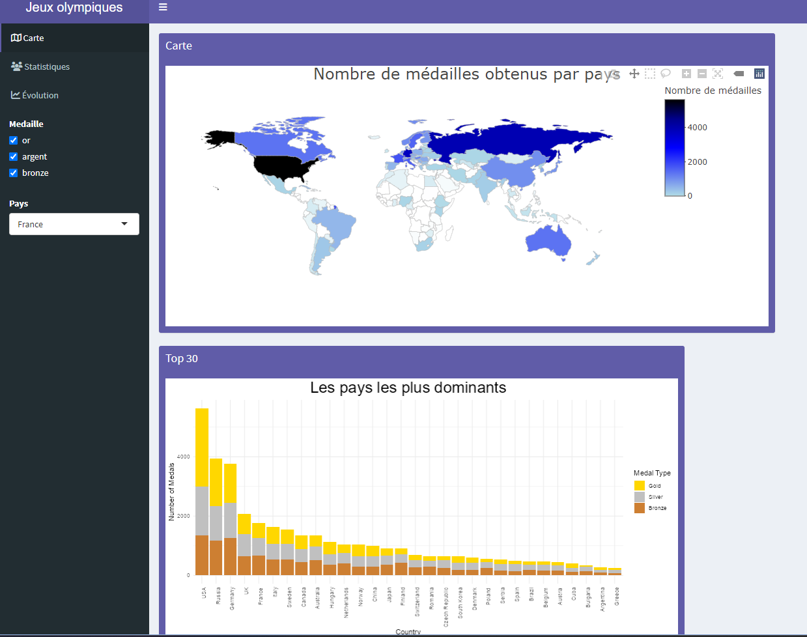
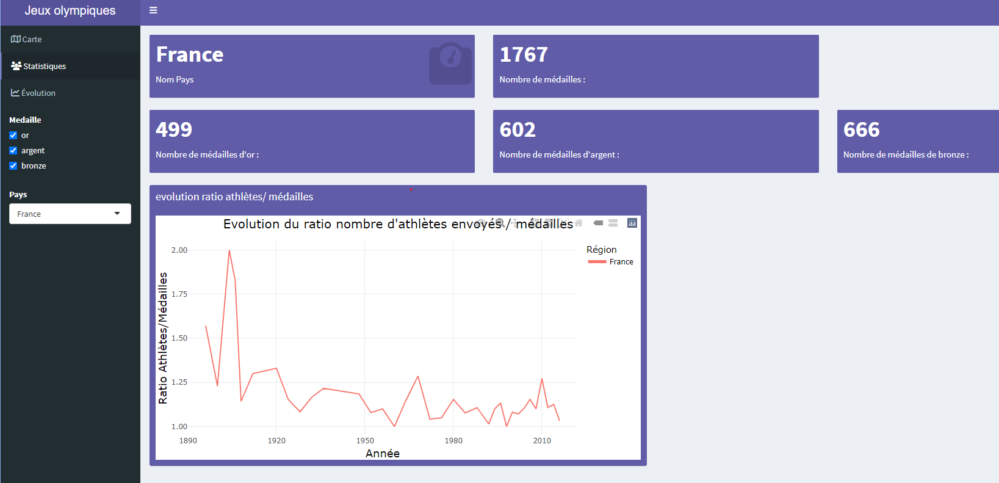
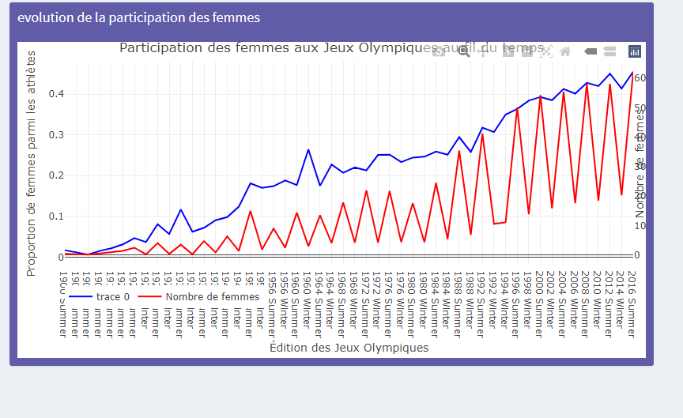

```{r setup, include=FALSE}
library(dplyr)
library(ggplot2)
library(readr)
library(plotly)
library(tidyr)
library(ggrepel)
library(gridExtra)
library(grid)
library(readxl)
library(GGally)
library(RColorBrewer)
library(tidyverse)

```

```{r loading data, include=FALSE}
data_jo = read_csv('athlete_events.csv')
data_noc_regions <- read_csv('noc_regions.csv')
data_PIB <- read_delim('GDP_per_capita.csv', delim = ';')
data_iso_regions <- read_csv('iso_regions.csv')
```

</br>

<p align="center">

</p>

</br>

# Introduction

Le jeu de données __"120 ans de l'histoire des Jeux Olympiques"__ contient les données de 28 éditions d'été et 22 d'hiver des Jeux Olympiques, ce qui équivaut à un peu moins de 136 000 individus, répartis sur 15 variables. Ces variables comprennent des informations telles que le nom de l'athlète, son âge, son poids, sa taille, son sexe, la saison des Jeux Olympiques, les médailles remportées, etc. Les données proviennent du site www.sports-reference.com et elles sont le résultat d'un travail de recherche réalisé par un groupe intéressé par l'histoire des jeux olympiques. Le site propose une base de données complète avec des informations diverses et variées sur les médailles gagnées par chaque pays, les résultats des compétitions, et bien plus encore.

Nous avons sélectionné un ensemble de données sur les Jeux olympiques en raison de l'engouement actuel en France pour cet événement, en particulier avec les Jeux olympiques de **Paris 2024** à l'horizon. Les Jeux olympiques représentent une célébration mondiale de l'excellence sportive et de la diversité culturelle, et ils captivent l'attention de millions de personnes à travers le monde. Avec des membres de notre groupe ayant des niveaux de connaissances variés sur les Jeux olympiques, l'étude de ce dataset nous offre l'opportunité unique de plonger dans l'histoire et les tendances de cet événement emblématique, tout en élargissant notre compréhension de l'impact du sport sur la société à travers les âges.

Le jeu de données est disponible sur [Cette page Kaggle](https://www.kaggle.com/datasets/heesoo37/120-years-of-olympic-history-athletes-and-results?select=athlete_events.csv) et a été publié par [**Randi H Griffin**](https://www.linkedin.com/in/randigriffin/), une Lead Data Scientist chez __BCG__, dans le but de découvrir l'évolution des Jeux Olympiques ainsi que la participation et les performances des athlètes et des pays. Les données sont fournies au format __CSV__.

</br>

## Données

Le tableau ci-dessous présente les **15 attributs** du jeu de données sur lequel nous allons travailler. Ces données sont extraites d'un ensemble de données concernant les performances des athlètes aux Jeux olympiques.

Chaque attribut offre des informations précieuses sur les athlètes, les événements sportifs et les médailles remportées. Ces données sont pertinentes pour notre projet car elles nous permettront d'analyser les performances des athlètes dans différents sports et événements, d'étudier les tendances au fil des éditions des Jeux olympiques et d'identifier les caractéristiques des médaillés olympiques.

Certaines variables, telles que **le sexe de l'athlète**,**la saison des Jeux olympiques (été ou hiver)** et **la nationalité de l'équipe de l'athlète**, présentent des catégories ou des sous-groupes au sein des données, ce qui nous permettra d'effectuer des analyses plus détaillées en fonction de ces caractéristiques.

Le tableau ci-dessous offre une description détaillée de chaque attribut, y compris son nom, sa signification et son type de données. Ces informations serviront de référence tout au long de notre projet.

<br>
<div width="100%" align="center">

| Attribut   | Description                  | Type     | Format | Catégorie |
|------------|------------------------------|----------|-----------|-----------|
| **ID**         | Identifiant unique de l'athlète        | Texte | String | Nominal |
| **Name**       | Nom de l'athlète                | Texte    | String | Nominal |
| **Sexe**       | Sexe de l'athlète ***(homme ou femme)***            | Texte    | String | Nominal |
| **Age**        | Âge de l'athlète lors des Jeux olympiques              | Numérique| Integer | Continu|
| **Height**     | Taille de l'athlète en centimètres          | Numérique| Integer | Continu |
| **Weight**     | Poids de l'athlète en kilogrammes           | Numérique| Float | Continu |
| **Team**       | Nationalité de l'équipe de l'athlète           | Texte    | String | String | Nominal|
| **NOC**        | Abréviation du Comité national olympique de l'équipe          | Texte    | String | Nominal|
| **Games**      | Nom de l'édition des Jeux olympiques          | Texte    |  String | Nominal|
| **Year**       | Année de l'édition des Jeux olympiques        | Texte    | YYYY | Discret |
| **Season**     | Saison des Jeux olympiques ***(été ou hiver)***     | Texte    | String| Ordinal |
| **City**       | Ville hôte des Jeux olympiques        | Texte    | String | Nominal |
| **Sport**      | Sport pratiqué par l'athlète          | Texte    | String | Nominal |
| **Event**      | Événement sportif dans lequel l'athlète a participé   | Texte    | String | Nominal |
| **Medal**      | Type de médaille remportée par l'athlète ***(or, argent, bronze ou aucune)*** | Texte    | String | Ordinal|
</div>
</br>

## Plan d'analyse
Nous avons compilé une série de questions que nous tenterons de résoudre en utilisant le jeu de données. Pour chaques question, nous avons une liste d'examples de visualisations possibles. Ces questions sont divisées en deux catégories principales : l'évolution des Jeux Olympiques et les performances des athlètes. 

#### L'évolution des Jeux Olympiques
1. Quels pays ont exercé une domination dans l'histoire des Jeux Olympiques ?  
   > Dans cette analyse, nous chercherons à identifier les pays qui ont accumulé le plus grand nombre de médailles dans l'histoire des Jeux Olympiques, qu'elles soient en or, argent ou bronze, ainsi que le total de ces médailles. De plus, nous déterminerons pour chaque discipline quel pays a remporté le plus de médailles.  
    > - **Graphique à barres des meilleurs pays par médailles :** pour comparer directement les performances des pays les plus réussis. Il permet une comparaison claire et rapide des totaux de médailles entre les principaux pays, ce qui est utile pour identifier les leaders incontestés et les écarts significatifs entre eux.
    > - **Diagramme circulaire ou camembert des médailles par type :** pour illustrer la répartition des médailles par type pour chaque pays. Il offre une vue d'ensemble instantanée des performances relatives en or, argent et bronze, permettant de déterminer si un pays a une domination particulière dans une catégorie de médailles.
    > - **Courbe présentant l'évolution du nombre total de médailles sur les 150 dernières années pour les pays dominants :** permet d'identifier les périodes de domination ou de déclin, ainsi que les évolutions à long terme des performances olympiques des pays.
    
2. Comment les Jeux Olympiques d'été se différencient-ils aux Jeux Olympiques d'hiver ?
   > Cette question examine comment les Jeux Olympiques d'été se différencient des Jeux Olympiques d'hiver en termes de sports pratiqués, de nombre d'épreuves , de participants, et d'autres aspects. Elle met en évidence les distinctions entre les deux versions du même évènement.  
     > - **Graphique en barres du nombre d'épreuves :** graphique en barres comparant le nombre total d'épreuves aux Jeux Olympiques d'été et d'hiver au fil du temps. Cela permet de visualiser les variations dans la taille et la complexité des deux événements au fil des ans.
     > - **Diagramme circulaire des participants :** Un diagramme circulaire montrant la répartition des participants par région ou pays aux Jeux Olympiques d'été et d'hiver. Cela permet de comparer la diversité géographique des participants entre les deux événements.
     > - **Graphique en barres empilées des médailles par pays :** Un graphique en barres empilées comparant les médailles remportées par chaque pays aux Jeux Olympiques d'été et d'hiver. Cette visualisation met en évidence les performances des pays dans les deux types de jeux et permet de déterminer s'il existe des différences significatives dans les pays dominant chaque événement.
    
3. Comment varie le nombre d'épreuves sportives et le nombre d'athlètes participant aux Jeux Olympiques au fil du temps ?  
   > L'objectif ici est de déterminer quels sont les sports qui ont été intégrés au cours des années et à quel moment ceux ci se sont intégrés. Ceci aussi a pour visée de déterminer la raison de l'ajout de ces disciplines(popularité grandissante ou juste nouveau sport). Dans un second temps il s'agira d'identifier ou non l'entrée en liste de nouveaux pays participants dans les jeux. D'en déterminer les origines(première qualification ou alors accueil de nouveaux pays admissibles). Enfin il s'agit de déterminer comment évolue le nombre d'athlètes participant aux jeux au fil des années.  
	> - **Graphique en ligne du nombre d'athlètes par année :** Un graphique en ligne représentant l'évolution du nombre total d'athlètes participant aux Jeux Olympiques au fil des ans. Cette visualisation mettrait en évidence les variations dans la taille de la délégation olympique mondiale au fil du temps.
   	> - **Graphique en barres du nombre d'épreuves par discipline sportive :** Un graphique en barres montrant le nombre d'épreuves par discipline sportive (par exemple, course, lancer, saut pour l'athlétisme) aux Jeux Olympiques au fil du temps. Cela offre une vue détaillée des changements dans la composition et la diversité des épreuves sportives au fil des ans.
    
4. Est-ce que le pays hôte des Jeux Olympiques bénéficie d'un avantage par rapport aux autres nations participantes ?  
   > Cette question vise à déterminer si le pays hôte des Jeux Olympiques bénéficie d'un avantage en termes de participation et de performances sportives, telles que le nombre de médailles accumulées, par rapport aux autres nations participantes. L'objectif est d'analyser si le fait d'accueillir les Jeux Olympiques donne un élan supplémentaire aux athlètes du pays hôte, leur permettant de performer au-dessus de la moyenne par rapport à leurs performances habituelles.  
	> - **Graphique en barres du nombre de médailles par pays :** Un graphique en barres comparant le nombre total de médailles remportées par le pays hôte par rapport aux autres nations participantes. Cela permettrait de voir visuellement si le pays hôte obtient plus de médailles que la moyenne des autres pays.
 	> - **Graphique en barres empilées des médailles par type pour le pays hôte et les autres nations :** Un graphique en barres empilées montrant la répartition des médailles d'or, d'argent et de bronze remportées par le pays hôte et les autres nations participantes. Cette visualisation permettrait de comparer les performances dans chaque catégorie de médailles.
	> - **Nuage de points des performances par rapport à la moyenne :** Un nuage de points avec le pays hôte et les autres nations sur l'axe des x et le nombre total de médailles sur l'axe des y. Chaque point représenterait une édition des Jeux Olympiques, et sa position par rapport à une ligne moyenne permettrait de visualiser si le pays hôte surperforme ou sous-performe par rapport à la moyenne des autres nations.
   
5. Existe-t-il une relation entre le niveau économique d'un pays et ses performances aux Jeux Olympiques ?
   > Il est intéressant d'explorer si le niveau économique d'un pays, mesuré par le PIB par habitant, influence ses performances aux Jeux Olympiques. Cette analyse nous aide à voir comment l'argent et les ressources affectent les succès sportifs à travers les nations.  
   > Nous utilisons une [base de donnée](https://databank.worldbank.org/indicator/NY.GDP.PCAP.CD/1ff4a498/Popular-Indicators#) du PIB/habitant par pays depuis 1960 créée par [La Banque Mondiale](https://www.worldbank.org/en/home).  
	> - **Nuage de points du PIB par habitant par rapport au nombre de médailles :** Un nuage de points avec le PIB par habitant sur l'axe des x et le nombre total de médailles remportées sur l'axe des y pour chaque pays participant aux Jeux Olympiques. Chaque point représente un pays pour une année donnée, permettant de visualiser s'il existe une corrélation entre la richesse économique d'un pays et son succès aux Jeux Olympiques.
	> - **Graphique en ligne de l'évolution du PIB par habitant et du nombre de médailles :** Un graphique en ligne avec le PIB par habitant et le nombre total de médailles remportées pour chaque année olympique. Cette visualisation permettrait d'observer comment l'évolution du niveau économique d'un pays au fil du temps est liée à ses performances aux Jeux Olympiques.
    

#### Les athlètes
6. Quels sont les athlètes qui ont marqué les jeux olympiques ?  
   > Cette question cherche à identifier les athlètes qui ont marqué les Jeux Olympiques par leurs performances exceptionnelles. L'objectif est d'analyser les données historiques des Jeux Olympiques pour identifier les athlètes les plus médaillés, les records établis et les moments marquants de l'histoire des Jeux.
	> - **Graphique en barres des athlètes les plus médaillés :** n graphique en barres montrant les athlètes ayant remporté le plus grand nombre de médailles olympiques, classés par discipline sportive ou nombre total de médailles. Cette visualisation permettrait d'identifier les athlètes les plus titrés de l'histoire des Jeux Olympiques.
	> - **Graphique en nuage de points des records battus au fil du temps :** Un graphique en nuage de points représentant les records olympiques battus au fil des éditions des Jeux Olympiques. Chaque point représenterait un record battu dans une discipline sportive spécifique, avec l'année sur l'axe des x et la performance réalisée sur l'axe des y. Cette visualisation permettrait de visualiser les tendances et les progrès réalisés dans différentes disciplines au fil du temps.
    
7. Quels sont les impacts des caractéristiques physiques sur les résultats ?  
   > Cette question vise à explorer les impacts des caractéristiques physiques des athlètes sur leurs performances aux Jeux Olympiques. L'objectif est d'analyser comment des facteurs tels que la taille, le poids, l'âge et d'autres caractéristiques physiques peuvent influencer les résultats sportifs.<br>
	> - **Graphique en nuage de points de la taille et du poids des médaillés :** Un graphique en nuage de points représentant la relation entre la taille et le poids des athlètes médaillés dans différentes disciplines sportives. Cela permettrait d'identifier s'il existe des tendances générales entre les caractéristiques physiques des athlètes et leurs performances.
	> - **Graphique en barres des médailles par tranche d'âge :** Un graphique en barres montrant la répartition des médailles par tranche d'âge des athlètes. Cela permettrait d'analyser si les performances sportives varient en fonction de l'âge des athlètes et s'il existe des différences significatives entre les groupes d'âge.
	> - **Analyse de corrélation entre les caractéristiques physiques et les performances (Nuage) :** Une analyse statistique explorant les corrélations entre les caractéristiques physiques telles que la taille, le poids, l'âge, etc., et les performances sportives des athlètes. Cette analyse pourrait mettre en évidence les facteurs physiques qui ont le plus d'impact sur les résultats sportifs aux Jeux Olympiques.
    
8. Est-ce que la répartition des médailles entre hommes et femmes varie selon les pays ?  
   > Cette question vise à examiner si la répartition des médailles entre hommes et femmes varie d'un pays à l'autre aux Jeux Olympiques. L'objectif est d'analyser les différences de performances entre les athlètes masculins et féminins dans différentes nations participantes.<br>
	> - **Graphique en barres de la répartition des médailles par genre pour chaque pays :** Un graphique en barres comparant le nombre total de médailles remportées par les athlètes masculins et féminins pour chaque pays participant. Cela permettrait de visualiser visuellement les différences de performances entre hommes et femmes dans différents pays.
	> - **Graphique en secteurs ou camembert de la répartition des médailles par genre :** Un graphique en secteurs montrant la répartition des médailles entre hommes et femmes pour l'ensemble des Jeux Olympiques. Cela pourrait révéler la proportion relative de médailles remportées par chaque genre et mettre en évidence les pays où les performances des femmes sont les plus ou les moins représentées.
    
9. Comment la représentation des femmes aux Jeux Olympiques a-t-elle évolué au fil du temps ?  
   > Cette question vise à analyser l'évolution de la représentation des femmes aux Jeux Olympiques au fil du temps. L'objectif est d'identifier les tendances et les changements dans la participation et les performances des athlètes féminines dans différents sports et pays au fil des éditions des Jeux Olympiques.<br>
	> - **Graphique en ligne de la participation des femmes au fil du temps :** Un graphique en ligne montrant la proportion de femmes parmi tous les athlètes participants aux Jeux Olympiques au fil des éditions. Cela permettrait de visualiser la tendance à l'augmentation de la participation des femmes dans le sport olympique.
	> - **Graphique en barres de la répartition des médailles par genre au fil du temps :** Un graphique en barres comparant le nombre total de médailles remportées par les athlètes masculins et féminins pour chaque édition des Jeux Olympiques. Cela permettrait de visualiser visuellement les changements dans les performances des femmes par rapport aux hommes au fil du temps.
	> - **Carte géographique de la participation féminine par pays :** Une carte géographique montrant la participation des athlètes féminines dans différents sports et pays au fil des éditions des Jeux Olympiques. Cela permettrait de visualiser les variations régionales dans la représentation des femmes dans le sport olympique et d'identifier les pays où des progrès significatifs ont été réalisés en matière d'inclusion des femmes dans le sport.
    
# Analyse

</br>

## 1. Les pays donminants

Pour commencer notre analyse, nous allons nous concentrer sur la première question : Quels pays ont exercé une domination dans l'histoire des Jeux Olympiques ?  
Cette question vise à identifier les nations qui se sont distinguées par leurs performances exceptionnelles et régulières aux Jeux Olympiques.  
Cette analyse sera également utile pour mieux comprendre les résultats des prochaines questions analysées, en fournissant un contexte sur les dynamiques historiques et les tendances de performance des différentes nations.

</br></br>

```{r Question1-A, echo=FALSE, fig.align="center"}
country_medal_counts <- data_jo %>%
  group_by(NOC) %>%
  filter(!is.na(Medal)) %>%
  summarise(total_medals = n())

# Define bins for the histogram
bins <- c(0, 1, 10, 100, 1000, Inf)

labels_bins <- c("0-1", "1-10", "10-100", "100-1000", "1000+")

# Create histogram with defined bins
ggplot(country_medal_counts, aes(x = cut(total_medals, bins, labels = labels_bins))) +
  geom_bar(stat = "count", fill = "skyblue", color = "black") +
  labs(x = "Nombre de Médailles", y = "Nombre de pays", title = "Distribution du nombre des médailles") +
  scale_x_discrete(labels = labels_bins) +
  theme_minimal() +
  theme(plot.title = element_text(hjust = 0.5, size = 18))

```

</br>

```{r Question1-B, echo=FALSE, message=FALSE, warning=FALSE, fig.align="center", fig.width = 9}


number_of_medals <- data_jo %>%
  distinct() %>%
  filter(!is.na(Medal)) %>%
  left_join(data_noc_regions, by = "NOC") %>%
  group_by(region) %>%
  summarize(Medals = n()) %>%
  right_join(data_iso_regions, by = "region") %>%
  mutate(Medals = ifelse(is.na(Medals), 0, Medals))

plot_ly(
  data = number_of_medals,
  type = 'choropleth',
  locations = ~ ISO,
  z = ~ Medals,
  text = ~ region,
  colorscale = list(
    c(0, 0.01,  0.5, 0.8, 1),
    c('white', 'lightblue', 'blue' , 'darkblue', 'black')
  ),
  autocolorscale = FALSE,
  marker = list(line = list(color = 'rgb(180,180,180)', width = 0.5)),
  colorbar = list(title = "Nombre de médailles")
) %>%
  layout(
    title = list(
      text = "Nombre de médailles obtenus par pays",
      y = 0.99,
      font = list(size = 24)
    ),
    margin = list(
      l = 0,
      r = 0,
      b = 0,
      t = 20,
      pad = 0
    ),
    geo = list(
      showframe = FALSE,
      showcoastlines = FALSE,
      projection = list(type = 'Mercator')
    )
  )
```

Comme on peut voir sur ces deux graphiques, la majorité des pays on aucune ou peu de médailles (entre 0 et 100) et une minorité de pays à un grand nombre de médailles (500+). On peut voir sur la carte que les pays ayant un grand nombre de médailles sont principalements situés en Amérique du Nord et en Europe ainsi que les pays considérés comme riches (Chine, Australie, Brésil) comme nous le veront à la question 5.

</br><hr width="20%" /></br>

```{r Question1-C, echo=FALSE, fig.align="center", fig.width = 14}
data_filtered <- data_jo %>%
  distinct() %>%
  filter(!is.na(Medal)) %>%
  left_join(data_noc_regions, by = "NOC")


# Aggregate the total medal count per country and identify the top 10 countries
top_30_countries <- data_filtered %>%
  count(region) %>%
  top_n(30, n)


# Filter the original data to include only these top 10 countries
top_30_data <- data_filtered %>%
  filter(region %in% top_30_countries$region)

top_30_data$Medal <-
  factor(top_30_data$Medal, levels = c("Gold", "Silver", "Bronze"))

# Aggregate the data to count the number of each type of medal per country
medals_per_country <- top_30_data %>%
  count(region, Medal)

# Create a stacked histogram of the number of medals per country by type, ordered by total medals
ggplot(medals_per_country, aes(
  x = reorder(region,-n),
  y = n,
  fill = Medal
)) +
  geom_bar(stat = "identity") +
  labs(title = "Stacked Histogram of Medals per Country (Top 30)",
       x = "Country",
       y = "Number of Medals",
       fill = "Medal Type") +
  scale_fill_manual(values = c(
    "Gold" = "#FFD700",
    "Silver" = "#C0C0C0",
    "Bronze" = "#CD7F32"
  )) +
  theme_minimal() +
  theme(axis.text.x = element_text(angle = 90, hjust = 1)) +
  theme(plot.title = element_text(hjust = 0.5, size = 24))

```

</br>

```{r Question1-D, echo=FALSE, fig.align="center", fig.width = 14}
data_filtered_2 <- data_jo %>%
  distinct() %>%
  left_join(data_noc_regions, by = "NOC")

athletes_per_region <- data_filtered_2 %>%
  group_by(region) %>%
  summarize(Distinct = n_distinct(ID), Total = n()) %>%
  arrange(desc(Total)) %>%
  head(30)

ggplot(athletes_per_region, aes(x = reorder(region,-Total))) +
  geom_bar(aes(y = Total, fill = "Total"), stat = "identity", alpha = 1) +
  geom_bar(aes(y = Distinct, fill = "Distinct"),
           stat = "identity",
           alpha = 1) +
  labs(title = "Numbers of Athletes per Region",
       x = "Region",
       y = "Count",
       fill = "Legend") +
  scale_fill_manual(values = c("Total" = "lightblue", "Distinct" = "lightgreen"),
                    name = "Type") +
  theme_minimal() +
  theme(axis.text.x = element_text(
    angle = 90,
    vjust = 0.5,
    hjust = 1
  )) +
  theme(plot.title = element_text(hjust = 0.5, size = 24))

```

</br>

Il est intéréssant de remarquer que les même pays sont dans le top de classement de médailles de du nombre d'athlètes envoyés avec les même 6 pays au top des classements (États-Unis, Russie, Allemagne, Angleterre, France et Italie)

</br><hr width="20%" /></br>

```{r Question1-E, echo=FALSE, message=FALSE, warning=FALSE, fig.align="center"}
country_summary_with_regions <- data_jo %>%
  left_join(data_noc_regions, by = "NOC") %>%
  group_by(region) %>%
  summarise(Medailles = sum(!is.na(Medal)),
            Athletes = n_distinct(Name),) %>%
  arrange(desc(Medailles)) %>%
  filter(!is.na(region))

ggplot(country_summary_with_regions,
       aes(x = Medailles, y = Athletes, label = region)) +
  geom_point(color = "blue",
             size = 3,
             alpha = 0.5) +
  geom_smooth(
    method = "lm",
    se = FALSE,
    color = "black",
    size = 0.3
  ) +
  geom_text_repel(size = 3, segment.color = "transparent") +
  labs(x = "Nombre de Medailles", y = "Nombre d'athlètes envoyés") +
  theme_minimal() +
  ggtitle("Medailles vs. Athlètes envoyés par pays") +
  theme(plot.title = element_text(hjust = 0.5, size = 18))

```

</br>

Ce graphique indique la performance de chaque pays en fesant un ratio du nombre de médailles obtenus pour le nombre d'athlètes envoyés.

Il est remarquable de constater que les pays au-dessus de la ligne de tendance sous-performent par rapport à cette moyenne, tandis que ceux en dessous sur-performent (notamment la Russie, les États-Unis et l'Allemagne), alors que ceux au dessus de la ligne sous-performent.

</br><hr width="20%" /></br>

#### Conclusion :
Nous avons vu que les résulats aux Jeux Olympiques ne sont pas homogènes, il y a un grand nombre de pays ayant peu de participation alors qu'une poignée à énormément de participation. Il est important de garder ces résultats en tête dans les prochaines analyses afin de mieux les apréhender.

</br><hr /></br>

## 2. La différence des sessions d'hiver et d'été

Pour poursuivre notre analyse, nous allons nous concentrer sur la deuxième question : "Comment les Jeux Olympiques d'été se différencient-ils des Jeux Olympiques d'hiver ?"

Cette question vise à examiner les différences et similitudes entre les éditions estivales et hivernales des Jeux Olympiques. Cette analyse nous permettra de mieux comprendre les spécificités de chaque saison olympique et d'identifier les tendances uniques qui caractérisent les Jeux d'été et d'hiver. De plus, cette étude fournira un contexte précieux pour les questions suivantes, en mettant en lumière les variations saisonnières dans l'organisation et les performances des Jeux Olympiques.

</br></br>

```{r Question2-A, echo=FALSE, fig.align="center", fig.width = 10}

# Filter data for Summer and Winter seasons
summer_data <- data_jo %>% distinct() %>% filter(Season == "Summer")
winter_data <- data_jo %>% distinct() %>% filter(Season == "Winter")

# Count unique athletes for each edition (Year) and Season
summer_athletes_count <- summer_data %>%
  group_by(Year) %>%
  summarise(nombre_athletes = n_distinct(Name))

winter_athletes_count <- winter_data %>%
  group_by(Year) %>%
  summarise(nombre_athletes = n_distinct(Name))

combined_data <- bind_rows(
  mutate(summer_athletes_count, Season = "Summer"),
  mutate(winter_athletes_count, Season = "Winter")
)

# Plotting with ggplot2
ggplot(combined_data, aes(x = Year, y = nombre_athletes, color = Season)) +
  geom_line() +
  geom_point() +
  labs(x = "Année", y = "Nombre d'athlètes", color = "Session") +
  ggtitle("Nombre d'athlètes aux Jeux Olympique d'été et d'hiver") +
  theme_minimal() +
  theme(plot.title = element_text(hjust = 0.5, size = 20))
```

</br>

```{r Question2-B, echo=FALSE, fig.align="center", fig.width = 14}


# Count unique athletes for each edition (Year) and Season
summer <- summer_data %>%
  group_by(Year) %>%
  summarise(event = n_distinct(Event), sport = n_distinct(Sport))

winter <- winter_data %>%
  group_by(Year) %>%
  summarise(event = n_distinct(Event), sport = n_distinct(Sport))

combined_data <- bind_rows(mutate(summer, Season = "Summer"),
                           mutate(winter, Season = "Winter"))

# Plotting with ggplot2
p1 <-
  ggplot(combined_data, aes(x = Year, y = sport, color = Season)) +
  geom_line() +
  geom_point() +
  labs(x = "Année", y = "Nombre de sports", color = "Session") +
  theme_minimal() +
  guides(color = "none")

p2 <-
  ggplot(combined_data, aes(x = Year, y = event, color = Season)) +
  geom_line() +
  geom_point() +
  labs(x = "Année", y = "Nombre d'épreuves", color = "Session") +
  theme_minimal() +
  guides(color = "none")

grid.arrange(
  p1,
  p2,
  ncol = 2,
  top = textGrob("Evolution du nombre de sport et d'epreuves", gp = gpar(fontsize =
                                                                           28))
)
```

</br>

On peut clairement voir sur le premier graphique que la participation aux Jeux Olympiques d'été est nettement supérieure à celle des Jeux d'hiver. On peut également observer sur le même graphique des pics de baisse de participation qui seront expliqués dans la prochaine partie (Question 3).

Les deux autres graphiques mettent en lumière une des raisons de cette disparité entre les deux sessions : le nombre de sports et d'épreuves dans chaque session. En effet, pendant la session d'été, il y a bien plus de sports que pendant celle d'hiver. Il est quand même intéressant de voir que le nombre d'épreuves et de sports augmente de la même manière, que ce soit pour les Jeux d'été ou d'hiver.


</br><hr width="20%" /></br>

```{r Question2-C, echo=FALSE, message=FALSE, warning=FALSE, fig.align="center", fig.width = 9}


ratio_summer_winter <- data_jo %>%
  group_by(Season) %>%
  summarise(unique_athletes = n_distinct(ID)) %>%
  spread(Season, unique_athletes) %>%
  mutate(ratio = Summer / Winter) %>%
  select(ratio) %>%
  pull()

data_filtered <- data_jo %>%
  distinct() %>%
  left_join(data_noc_regions, by = "NOC") %>%
  group_by(region, Season) %>%
  summarize(unique_athletes = n_distinct(ID)) %>%
  ungroup() %>%
  spread(key = Season, value = unique_athletes) %>%
  mutate(Summer = ifelse(is.na(Summer), 0, Summer),
         Winter = ifelse(is.na(Winter), 0, Winter)) %>%
  mutate(ratio = ifelse(Winter == 0, 100, Summer / Winter / ratio_summer_winter)) %>%
  mutate(ratio = pmin(ratio, 10)) %>%
  left_join(data_iso_regions, by = "region")

plot_ly(
  data = data_filtered,
  type = 'choropleth',
  locations = ~ ISO,
  z = ~ ratio,
  text = ~ region,
  colorscale = list(c(0, 0.1, 0.5, 1), c('blue', 'pink', 'red' ,'darkred')),
  autocolorscale = FALSE,
  marker = list(line = list(color = 'rgb(180,180,180)', width = 0.5)),
  colorbar = list(title = "Préférence de session\nété (rouge) / hiver (bleu)")
) %>%
  layout(
    title = list(
      text = "Participation aux Jeux Olympiques d'été / d'hiver par pays",
      y = 0.99,
      font = list(size = 24)
    ),
    geo = list(
      showframe = FALSE,
      showcoastlines = FALSE,
      projection = list(type = 'Mercator')
    )
  )
```

</br>

Cette carte indique pour chaque pays le ratio d'athlètes envoyés aux Jeux Olympiques d'été et d'hiver. Le ratio de préférence est normalisé par rapport à la moyenne des pays : les pays envoient en moyenne trois fois plus d'athlètes aux Jeux Olympiques d'été qu'aux Jeux d'hiver. Il est donc logique de voir que les pays "chauds" (Amérique du Sud, Afrique, Asie du Sud-Est) ont un ratio très élevé, car ils n'envoient presque aucun athlète aux Jeux d'hiver. De la même façon, les pays "froids" (Canada, Russie, pays nordiques...) favorisent les Jeux Olympiques d'hiver.

</br><hr width="20%" /></br>

#### Conclusion :
Notre analyse des Jeux Olympiques d'été et d'hiver met en évidence des différences significatives en termes de participation, de nombre de sports et d'épreuves, ainsi que des préférences des pays en fonction de leur climat. Les Jeux d'été attirent un plus grand nombre de participants et proposent une variété de sports plus large comparé aux Jeux d'hiver. Les variations saisonnières dans l'organisation et les performances des Jeux sont influencées par des facteurs géographiques et climatiques, avec les pays "chauds" favorisant les Jeux d'été et les pays "froids" favorisant les Jeux d'hiver.

</br><hr /></br>

## 3. La participation à travers les âges

Pour continuer notre analyse, nous allons nous concentrer sur la troisième question : "Comment varie le nombre d'épreuves sportives et le nombre d'athlètes participant aux Jeux Olympiques au fil du temps ?"

Cette question vise à explorer l'évolution des Jeux Olympiques en termes de diversité des sports proposés et de participation des athlètes. En examinant les données historiques, nous analyserons les tendances dans l'augmentation ou la diminution du nombre d'épreuves sportives ainsi que le nombre d'athlètes participants au fil des différentes éditions des Jeux. Cette analyse nous aidera à comprendre les facteurs ayant influencé ces changements, en montrant comment l'évolution des Jeux a reflété et influencé les dynamiques du monde sportif international.

</br>

```{r Question3-A, echo=FALSE, fig.align="center", fig.width = 10}
summer_data <-
  data_jo %>%
  distinct() %>%
  filter(Season == "Summer") %>%
  group_by(Year) %>%
  summarise(nombre_athletes = n_distinct(Name),
            nombre_pays = n_distinct(NOC))

# Plotting with ggplot2
ggplot(summer_data, aes(x = Year)) +
  geom_line(aes(y = nombre_athletes), color = "darkblue") +
  geom_point(aes(y = nombre_athletes), color = "darkblue") +
  geom_bar(
    aes(y = nombre_pays * 50),
    stat = "identity",
    alpha = 0.5,
    fill = "green"
  ) +
  scale_y_continuous(name = "Nombre d'athlètes",
                     sec.axis = sec_axis( ~ . * (1 / 50), name = "Nombre de pays")) +
  labs(x = "Année", color = "Session") +
  ggtitle("Nombre d'athlètes et de pays aux Jeux Olympiques d'été") +
  theme_minimal() +
  theme(plot.title = element_text(hjust = 0.5, size = 20))
```

<br>

Ce graphique est intéressant car il permet de constater que les Jeux Olympiques n'ont pas eu lieu pendant la Seconde Guerre mondiale (1939-1945). De plus, il y a eu trois baisses significatives de la participation aux Jeux Olympiques d'été, en 1904, 1932, 1956, et de 1976 à 1984. Pendant ces six éditions, divers problèmes ont empêché un certain nombre de nations de participer aux événements :

- En 1904 et 1932 : Les Jeux Olympiques ont été organisés dans des villes des États-Unis : Saint-Louis et Los Angeles. Ce choix de localisation impliquait un voyage long et difficile pour les pays participants, principalement européens à cette époque.

- En 1956 : De nombreux conflits ont dissuadé de nombreux athlètes de participer : l'affaire du Canal de Suez, le conflit entre l'Égypte et Israël, la violence en Afrique du Nord, etc. De plus, la ville hôte était Melbourne en Australie, éloignée du continent européen qui envoyait le plus de participants.

- De 1976 à 1984 : Il y a eu des boycotts des Jeux Olympiques dans le contexte de la guerre froide. Le boycott des Jeux Olympiques organisés en Russie ou aux États-Unis permettait de protester contre les événements de l'époque. Il est intéressant de voir que c'est seulement à cette occasion qu'il y a eu une vraie baisse du nombre de pays participants.

La carte ci-dessous indique les nations ayant boycotté (partiellement ou complètement) les éditions des Jeux Olympiques d'été pendant cette période :

</br>

<p align="center">

</p>

</br><hr width="20%" /></br>

```{r Question3-B, echo=FALSE, message=FALSE, warning=FALSE, fig.align="center", fig.width = 10}

# Count unique athletes for each edition (Year) and Season
athletes_count_year <- data_jo %>%
  distinct() %>%
  group_by(Year, Season) %>%
  #filter(Season == "Summer") %>%
  summarise(nombre_athletes = n_distinct(Name), nombre_sport = n_distinct(Sport), Season) %>%
  distinct()

# Plotting with ggplot2
ggplot(athletes_count_year, aes(x = Year, y = nombre_athletes / nombre_sport, color = Season)) +
  geom_line() +
  geom_point() +
  labs(x = "Année", y = "Nombre d'athlètes / sport", color = "Session") +
  ggtitle("Participation aux Jeux Olympique ajusté au nombre de sports") +
  theme_minimal() +
  theme(plot.title = element_text(hjust = 0.5, size = 20)) +
  facet_grid(. ~ Season) + 
  guides(color = "none")
```

</br>

Dans ce graphique, nous pouvons observer l'impact du nombre de sports sur la participation. En effet, lorsque nous normalisons la participation aux Jeux Olympiques par rapport au nombre de sports disponibles, nous remarquons que la participation par sport est assez similaire entre les différentes éditions.

</br><hr width="20%" /></br>

#### Conclusion :
Notre analyse nous a permis de retracer l'évolution des Jeux Olympiques à travers le prisme du nombre d'épreuves sportives et de la participation des athlètes. Nous avons constaté des fluctuations significatives dans la participation, souvent influencées par des facteurs géopolitiques et logistiques, tels que les conflits mondiaux ou les choix de localisation des Jeux. Les périodes de baisse de participation, telles que les années 1904, 1932, 1956 et 1976-1984, ont été marquées par des événements historiques majeurs et des boycotts politiques. Malgré ces fluctuations, notre analyse révèle une constante : une participation relativement stable par sport, suggérant une diversité maintenue malgré les défis rencontrés par les Jeux Olympiques au fil du temps.

</br><hr /></br>

## 4. L'impact du pays hôte

Pour poursuivre notre analyse, nous allons nous concentrer sur la quatrième question : "Est-ce que le pays hôte des Jeux Olympiques bénéficie d'un avantage par rapport aux autres nations participantes ?"
Cette question vise à déterminer si le pays hôte des Jeux Olympiques bénéficie d'un avantage en termes de participation et de performances sportives, telles que le nombre de médailles accumulées, par rapport aux autres nations participantes. L'objectif est d'analyser si le fait d'accueillir les Jeux Olympiques donne un élan supplémentaire aux athlètes du pays hôte, leur permettant de performer au-dessus de la moyenne par rapport à leurs performances habituelles.

Dans un premier temps nous allons observer l'évolution du nombre de médailles obtenus par les pays hotes à chaque jeu afin de déterminer si on observe des variations durant les années où ces pays reçoivent les jeux. Pour cela nous traçons un diagramme en ligne présentant le nombre de médailles obtenus chaque année par les pays hotes.

</br>

```{r Question4-A, echo=FALSE, message=FALSE, warning=FALSE, fig.align="center", fig.width = 10}
# liste des pays hotes
pays_hote <- read_csv('summer.csv')

#tibble contenant les données sur les médailles obtenus par les pays hotes
data_pays_hote <- data_jo %>% distinct() %>% left_join(data_noc_regions,by='NOC') %>% right_join(pays_hote,by=c('region'='Pays'),relationship='many-to-many') %>% filter(!is.na(Medal)) %>% select(region,Medal,Year)

#regroupement des valeurs par année et pays
data_pays_hote <- data_pays_hote %>% group_by(Year,region) %>% summarise(Medal = n())
```
```{r Question4-A-2, echo=FALSE, message=FALSE, warning = FALSE,fig.align="center", fig.width = 10}
p <- ggplot(data = data_pays_hote, aes(x = Year, y = Medal, color = region)) +
  geom_line() +
  labs(title = "Evolution du nombre de médailles des pays hotes",
       x = "Année",
       y = "Nombre de Médailles",
       color = "Région") +
  theme_minimal()

ggplotly(p) %>%
  layout(
    title = "Evolution du nombre de médailles des pays hotes",
    xaxis = list(title = "Année"),
    yaxis = list(title = "Nombre de Médailles"),
    legend = list(title = list(text = "Région"), itemsizing = "constant")
  )


```

On constate effectivement des pics de médailles pour les différents pays. C'est le cas de la France où des pics sont observés aux années 1900, 1924 années durant l'accueil le pays a accueilli des jeux. On est en droit de se demander si le fait d'etre un pays hote a eu des influences notamment sur les nombres d'athlètes envoyés.
On observe donc l'évolution du nombre d'athlètes envoyés par les pays hotes et on se concentre sur les années d'organisation des jeux.

</br><hr width="20%" /></br>

```{r Question4-C, echo=FALSE, message=FALSE, warning=FALSE, fig.align="center", fig.width = 10}
data4 <- data_jo %>% 
  distinct() %>% 
  left_join(data_noc_regions, by = 'NOC') %>% 
  right_join(pays_hote, by = c('region' = 'Pays')) %>%
  filter(!is.na(Medal)) %>%
  group_by(Year, region) %>%
  summarise(Medal = n(),
            nbre_athlete = n_distinct(Name)) %>% mutate(ratio = Medal/nbre_athlete)

p <- ggplot(data = data4, aes(x = Year, y = nbre_athlete, color = region)) +
  geom_line() +
  labs(title = "Evolution du nombre d'athlètes envoyés des pays hotes",
       x = "Année",
       y = "Nombre d'athlètes",
       color = "Région") +
  theme_minimal()

ggplotly(p) %>%
  layout(
    title = "Evolution du nombre d'athlètes envoyés des pays hotes",
    xaxis = list(title = "Année"),
    yaxis = list(title = "Nombre d'athlètes envoyés"),
    legend = list(title = list(text = "Région"), itemsizing = "constant")
  )

```

```{r Question4-D, echo=FALSE, message=FALSE, warning=FALSE, fig.align="center",warning=FALSE,fig.width = 10}
ggplot(data = data4, aes(x = nbre_athlete, y = Medal, color = region)) +
  geom_point() +
  geom_smooth()+
  labs(title = "Relation nbre athlètes nbre médailles",
       x = "nbre athlète",
       y = "nbre de medailles",
       color = "Région") +
  theme_minimal()
```

On observe effectivement que le nombre d'athlètes envoyés augmentent pendant les années d'accueil des jeux olympiques. Enfin il serait intéressant de voir si les athlètes ont été plus performants que les autres années en observant le ratio entre le nombre d'athlètes envoyés et le nombre de médailles obtenus.

```{r Question4-B, echo=FALSE, message=FALSE, warning=FALSE, fig.align="center", fig.width = 10}
#tibble contennt le ratio entre le nombre d'athletes envoyés et le nombre de médailles obtenus
data4 <- data_jo %>% 
  distinct() %>% 
  left_join(data_noc_regions, by = 'NOC') %>% 
  right_join(pays_hote, by = c('region' = 'Pays')) %>% 
  filter(!is.na(Medal)) %>%
  group_by(Year, region) %>%
  summarise(Medal = n(),
            nbre_athlete = n_distinct(Name)) %>% mutate(ratio = Medal/nbre_athlete)


p <- ggplot(data = data4, aes(x = Year, y = ratio, color = region)) +
  geom_line() +
  labs(title = "Evolution du ratio nombre d'athletes envoyés nombre de médailles pour le pays hote",
       x = "Année",
       y = "Ratio Athlete/Medaille",
       color = "Région") +
  theme_minimal()

ggplotly(p) %>%
  layout(
    title = "Evolution du ratio nombre d'athletes envoyés nombre de médailles pour le pays hote",
    xaxis = list(title = "Année"),
    yaxis = list(title = "Ratio Athlete/Medaille"),
    legend = list(title = list(text = "Région"), itemsizing = "constant")
  )

```


</br><hr width="20%" /></br>

### Conclusion :

A la question de savoir "Est-ce que le pays hôte des Jeux Olympiques bénéficie d'un avantage par rapport aux autres nations participantes ?", nous pouvons répondre avec l'affirmatif. En effet à la vue des différents graphes obtenus les pays hotes envoient beaucoup plus d'athlètes durant les années où elles organisent les jeux et obtiennent un très bon ratio de médailles obtenus. La cause serait que les athlètes soient mieux préparer et plus galvaniser par le fait d'accueillir les jeux à domicile.

</br><hr /></br>

## 5. L'impact du niveau économique

Dans cette section et pour répondre à la question "Existe-t-il une relation entre le niveau économique d'un pays et ses performances aux Jeux Olympiques ?", nous allons explorer les données économiques des pays participants aux Jeux Olympiques et analyser leur relation avec les performances sportives. Cette analyse nous permettra de mieux comprendre les dynamiques socio-économiques qui influencent les performances des nations aux Jeux Olympiques et d'identifier les tendances et les corrélations entre le PIB d'un pays et ses résultats sportifs.

</br>

```{r Question5-A, echo=FALSE, message=FALSE, warning=FALSE, fig.align="center", fig.width = 10}
# Renommer la première colonne de data_PIB en "Country" pour la jointure
names(data_PIB)[1] <- "Country"

# Préparer les données des Jeux Olympiques
data <- data_jo %>%
  filter(!is.na(Medal)) %>%
  group_by(NOC, Year) %>%
  summarise(total_medals = n()) %>%
  ungroup()

# Préparer les données de PIB par habitant
data_PIB_long <- data_PIB %>%
  pivot_longer(cols = starts_with('19') | starts_with('20') | starts_with('21'), names_to = "Year", values_to = "GDP_per_capita") %>%
  mutate(Year = as.numeric(Year)) %>%
  mutate(GDP_per_capita = as.numeric(GDP_per_capita))  # Assurez-vous que les valeurs de GDP_per_capita sont numériques

# Fusionner les données des JO avec les régions NOC
data <- data %>%
  left_join(data_noc_regions, by = "NOC")

# Fusionner les données des médailles avec les données de PIB par habitant
data_combined <- data %>%
  left_join(data_PIB_long, by = c("region" = "Country", "Year"))

# Filtrer les données complètes
data_combined <- data_combined %>%
  filter(!is.na(GDP_per_capita))

# Créer des tranches de PIB par habitant en utilisant des quantiles
data_combined <- data_combined %>%
  mutate(GDP_bin = cut(GDP_per_capita, breaks = quantile(GDP_per_capita, probs = seq(0, 1, by = 0.1), na.rm = TRUE), include.lowest = TRUE))

# Modifier les étiquettes des tranches de PIB
labels <- c("<1000", "1000-2000", "2000-3000", "3000-4000", "4000-5000", "5000-6000", "6000-7000", "7000-8000", "8000-9000", ">=9000")

# Créer un violin plot avec Plotly
p <- plot_ly(data_combined, y = ~total_medals, x = ~GDP_bin, type = 'violin', points = 'all',
             jitter = 0.3, pointpos = -1.8, marker = list(color = 'rgba(152, 0, 0, .8)'),
             text = ~paste('Country:', region, '<br>Year:', Year)) %>%
  layout(title = "Distribution des médailles par tranches de PIB par habitant",
         xaxis = list(title = "Tranches de PIB par habitant (USD)", 
                      categoryorder = "array",
                      categoryarray = unique(data_combined$GDP_bin),
                      ticktext = labels,
                      tickvals = unique(data_combined$GDP_bin)),
         yaxis = list(title = "Nombre total de médailles"))

# Ajouter des annotations
annotations <- list(
  list(x = 0.5, y = 1, xref = "paper", yref = "paper", text = "", 
       showarrow = FALSE, xanchor = "center", yanchor = "top", font = list(size = 20))
)

p <- p %>% layout(annotations = annotations)

# Afficher le graphique
p

```

le graphique de violon ci-dessus représente la distribution des médailles par tranches de PIB par habitant.Nous remarquons une distribution asymétrique des médailles, avec une concentration plus élevée dans les tranches de PIB plus élevées(3000-4000, 4000-5000 et 7000-8000).cela suggère l'existance d'une tendance où les tranche de PIB plus élevées ont tendance à remporter plus de médailles aux Jeux Olympiques, les outliers dans presque toutes les tranches de PIB indiquent que les performances sportives ne sont pas uniquement déterminées par le niveau économique d'un pays et qu'il existe des exceptions nitables.

</br><hr width="20%" /></br>

```{r Question5-B, echo=FALSE, message=FALSE, warning=FALSE, fig.align="center", fig.width = 10}
# Préparer les données pour le scatter plot
data_combined <- data_combined %>%
  filter(!is.na(GDP_per_capita), !is.na(total_medals))

# Créer un scatter plot avec une ligne de tendance
p_scatter <- plot_ly(data_combined, x = ~GDP_per_capita, y = ~total_medals, type = 'scatter', mode = 'markers',
                     marker = list(color = 'rgba(152, 0, 0, .8)'), text = ~paste('Country:', region, '<br>Year:', Year)) %>%
  layout(title = "Relation entre le PIB par habitant et le nombre total de médailles",
         xaxis = list(title = "PIB par habitant (USD)"),
         yaxis = list(title = "Nombre total de médailles")) %>%
  add_trace(
    mode = "lines", 
    y = fitted(lm(total_medals ~ GDP_per_capita, data = data_combined)), 
    x = ~GDP_per_capita,
    line = list(color = 'rgba(0, 0, 255, .8)')
  )

# Afficher le graphique
p_scatter

```

Le scatter-plot ci-dessus représente la relation entre le PIB par habitant et le nombre total de médailles remportées par un pays aux Jeux Olympiques.Ce graphique montre une corrélation positive entre ces deux variables, mais cette relation n'est pas linéaire et montre une grande variablité. Nous pouvons ainsi observer que la majorité des points sont concentrés dans la gamme inférieure du PIB par habitant entre 0 et 800 USD avec un un nombre de médailles principalement entre 0 et 20, la faible dispersion des médailles au-délà de 800 USD de PIB par habitant indique que les pays avec un PIB plus élevé ont une plus grande variabilité dans le nombre de médailles remportées, ce qui suggère que le niveau économique d'un pays n'est pas le seul facteur déterminant des performances sportives aux Jeux Olympiques.

</br><hr width="20%" /></br>


#### Conclusion :

Pour conclure, notre analyse des données économiques et des performances sportives aux Jeux Olympiques a révélé des tendances intéressantes et des corrélations significatives. Nous avons constaté que les pays avec un PIB par habitant plus élevé ont tendance à remporter plus de médailles, mais cette relation n'est pas linéaire et montre une grande variabilité. Les performances sportives ne sont pas uniquement déterminées par le niveau économique d'un pays, mais peut être influencé par autres facteurs, tels que l'investissement dans le sport, les infrastructures, la culture sportive et les politiques sportives, qui jouent un rôle important dans les résultats aux Jeux Olympiques. Cette analyse souligne l'importance de prendre en compte une variété de facteurs pour comprendre les performances sportives des nations aux Jeux Olympiques et met en lumière les complexités des dynamiques socio-économiques qui influencent les résultats sportifs à l'échelle internationale.

</br><hr /></br>

## 6. Les athlètes dominants

Pour poursuivre notre analyse, nous allons nous concentrer sur la sixième question : "Quels sont les athlètes qui ont marqué les jeux olympiques"
Cette question cherche à identifier les athlètes qui ont marqué les Jeux Olympiques par leurs performances exceptionnelles. Le nombre de médailles obtenus et leur longévité au cours de l'histoire des jeux.
Pour répondre à cette question on détermine les 10 athlètes les plus médaillés des jeux.On se concentre sur ceux ayant obtenu le plus de médailles d'or car on les considère comme ceux ayant eu de meilleurs résultats.

</br>

```{r Question6-A, echo=FALSE, message=FALSE, warning=FALSE, fig.align="center", fig.width = 10}
athletes_masc <- data_jo %>%
  distinct() %>%
  filter(Sex == 'M' & !is.na(Medal)) %>%
  group_by(Name, Medal) %>%
  count() %>% filter(Medal == 'Gold') %>% arrange(desc(n)) %>% head(10)

#athletes_masc

# Filtrer les données pour les athlètes les plus médaillés
top_athletes <- athletes_masc$Name

# Filtrer les données pour les athlètes les plus médaillés
athletes_medals <- data_jo %>%
  distinct() %>%
  filter(Sex == 'M' & !is.na(Medal) & Name %in% top_athletes)

# Créer le graphique à barres empilées
ggplot(athletes_medals, aes(x = Name, fill = Medal)) +
  geom_bar() +
  labs(title = "Répartition des types de médailles pour les athlètes les plus médaillés",
       x = "Athlètes",
       y = "Nombre de médailles") +
  scale_fill_manual(values = c(
    "Gold" = "#FFD700",
    "Silver" = "#C0C0C0",
    "Bronze" = "#CD7F32"
  ))+
  theme_minimal() +
  theme(axis.text.x = element_text(angle = 45, hjust = 1))

```

</br><hr width="20%" /></br>

```{r echo=FALSE, warning=FALSE,message=FALSE}
# meilleur athlète chaque sport
# Filtrer les athlètes ayant remporté des médailles et calculer le nombre de médailles par type
athletes_medals_type <- data_jo %>%
  filter(!is.na(Medal) & (Sport == 'Athletics'| Sport =='Gymnastics')) %>%
  group_by(Event, Name, Medal) %>%
  summarise(count = n()) %>%
  ungroup()

# Réorganiser les données pour avoir une colonne pour chaque type de médaille
athletes_medals_type_wide <- athletes_medals_type %>%
  pivot_wider(names_from = Medal, values_from = count, values_fill = list(count = 0))

# Calculer le nombre total de médailles et utiliser des critères supplémentaires pour départager
athletes_medals_ranked <- athletes_medals_type_wide %>%
  mutate(total_medals = Gold + Silver + Bronze) %>%
  group_by(Event) %>%
  arrange(desc(Gold), desc(Silver), desc(Bronze), desc(total_medals)) %>%
  slice(1) %>%
  ungroup()


```

Sur le graphique on observe les 10 meilleurs athlètes des jeux olympiques en terme de longévité et du nombre de médailles d'or obtenus, tous s'étant à un moment ou un autre de l'histoire imposé comme icone de sa discipline. Il s'agit de:
- Usain Bolt: Athlète sprinteur, connu comme leplus rapide de l'histoire et détenant le record du 100 mètres et 200m. Il a remporté 8 médailles d'or olympiques
- Michel Fred Phelps II: c'est l'atlète le plus décoré de tous les temps avec un total de 28 médailles dont 23 médailles d'or, 3 d'argent et 2 de bronze. C'est un des plus grands athlètes nageurs avec des records dans les épreuves du 100 m papillon et 200 m papillon
- Raymond Clarence: Athlète américain, spécialiste des sauts en hauteur, saut en longueur et triple saut avec près de 8 médailles d'or olympiques entre 1900 et 1908.

</br><hr width="20%" /></br>

#### Conclusion :

De nombreux athlètes ont su marqué l'histoire des jeux de par leur performance incroyable et des records qu'ils détiennent où ont eu à détenir. Ce qui est marquant c'est que tous les athlètes ayant obtenus le plus de médailles sont ceux s'étant présenté le plus de fois aux compétitions et dans les domaines d'athlétisme présentant le plus de variante notamment le saut, la natation ou encore la course. On pourrait se demander quels sont les facteurs à l'origine de leurs performances exceptionnelles?

</br><hr /></br>

## 7. Le physiques des athlètes

Pour poursuivre notre analyse des Jeux Olympiques, nous allons nous pencher sur la question suivante : "Comment les caractéristiques physiques des athlètes olympiques varient-elles en fonction de leur âge ?"

Cette question vise à explorer la relation entre l'âge des athlètes et leurs caractéristiques physiques, telles que la taille et le poids. En examinant les données des athlètes olympiques, nous analyserons comment ces caractéristiques affectent la remportée des médailles, en mettant en lumière les tendances et les différences observées dans les différentes tranches d'âge. Cette analyse nous permettra de mieux comprendre l'impact de l'âge sur les performances physiques des athlètes et d'identifier les caractéristiques physiques prédominantes dans les différentes catégories d'âge.

</br>

```{r Question7_graphe1, echo=FALSE, message=FALSE, warning=FALSE, fig.align="center", fig.width = 10}

# Préparer les données des Jeux Olympiques
data_filtered <- data_jo %>%
  filter(!is.na(Medal)) %>%
  distinct() %>%
  left_join(data_noc_regions, by = "NOC")

# Créer des tranches d'âge
data_filtered <- data_filtered %>%
  mutate(Age_bin = cut(Age, 
                       breaks = seq(10, 50, by = 10), 
                       right = FALSE, 
                       include.lowest = TRUE))

# Filtrer les données pour inclure seulement les lignes avec un âge disponible
data_filtered <- data_filtered %>%
  filter(!is.na(Age_bin))

# Agréger les données pour compter le nombre de médailles par tranche d'âge
medals_per_age_bin <- data_filtered %>%
  count(Age_bin, Medal)

medals_per_age_bin$Medal <-
  factor(medals_per_age_bin$Medal, levels = c("Gold", "Silver", "Bronze"))

# Créer un graphique en barres empilées pour les médailles par tranche d'âge
p <- ggplot(medals_per_age_bin, aes(x = Age_bin, y = n, fill = Medal)) +
  geom_bar(stat = "identity", position = "stack") +
  geom_text(aes(label = n), position = position_stack(vjust = 0.5), size = 3) +
  labs(title = "Distribution des médailles olympiques par tranche d'âge",
       x = "Tranche d'âge (années)",
       y = "Nombre de médailles",
       fill = "Type de médaille") +
  scale_fill_manual(values = c("Gold" = "#FFD700", "Silver" = "#C0C0C0", "Bronze" = "#CD7F32")) +
  theme_minimal() +
  theme(axis.text.x = element_text(angle = 90, hjust = 1)) +
  theme(plot.title = element_text(hjust = 0.5, size = 24))

# Afficher le graphique
print(p)

```

Ce graphique est intéressant car il montre la distribution des médailles olympiques par tranche d'âge. On peut voir que les athlètes de la tranche d'âge 20-30 ans sont les plus représentés parmi les médaillés, suivis par les athlètes de la tranche d'âge 30-40 ans.

Nous remarquons également que le nombre de médailles d'or, d'argent et de bronze est remarquablement proche. Cela suggère une performance sportive équilibrée tout au long des âges. Ainsi, quel que soit le groupe d'âge, les athlètes ont des chances similaires de remporter des médailles, bien que cela puisse être influencé par le nombre d'athlètes dans chaque catégorie.

Dans le but d'éviter tout biais lié à la tranche d'âge la plus médaillée, nous allons maintenant examiner la répartition des athlètes olympiques par tranche d'âge pour vérifier si le grand nombre de médailles dans la tranche d'âge 20-30 ans est dû à une plus grande participation dans cette catégorie ou à des caractéristiques physique spécifiques des athlètes de cette tranche d'âge.

</br><hr width="20%" /></br>

```{r Question7-graphe2, echo=FALSE, message=FALSE, warning=FALSE, fig.align="center", fig.width = 10}

# Création d'une variable Age_group pour regrouper les âges en tranches
data <- data_jo %>%
  mutate(Age_group = cut(
    Age,
    breaks = c(10, 20, 30, 40, 50),
    labels = c("10-20", "20-30", "30-40", "40-50"),
    include.lowest = TRUE
  )) %>%
  filter(!is.na(Age_group))

medals_per_age_bin <- data %>%
  filter(!is.na(Medal)) %>%
  count(Age_group)

ajusted_medals_per_age_bin <- data %>%
  group_by(Age_group) %>%
  summarize(total = n())

result <- merge(medals_per_age_bin, ajusted_medals_per_age_bin, by = "Age_group")

# Création du graphique en barres avec ggplot
p <- ggplot(data = result, aes(x = Age_group, y = n / total, fill = Age_group)) +
  geom_bar(stat = "identity", position = "dodge") +
  geom_text(aes(label = str_c(round(n / total * 100, 1), " %")), vjust = -0.5, size = 3) +
  labs(title = "Obtention de médaille par tranche d'âge",
       x = "Tranche d'âge",
       y = "Ratio d'obtention de médaille") +
  theme_minimal() +
  theme(axis.text.x = element_text(angle = 45, hjust = 1),
        plot.title = element_text(hjust = 0.5))

# Afficher le graphique
print(p)

```

Ce graphique montre la répartition des athlètes olympiques par tranche d'âge. On peut voir que la tranche d'âge la plus représentée est celle des 20-30 ans, suivie de près par la tranche d'âge des 30-40 ans.Ce qui fait de ces deux catégorie les plus actives.

Nous constatons que la tranche d'âge 20-30 ans est la plus représentée  à la fois parmi les athlètes olympiques et parmi les médaillés avec un totale de 139 947. Cela suggère que cette tranche d'âge est particulièrement compétitive et performante dans les compétitions olympiques. Cependant, il est important de noter que les athlètes de différentes tranches d'âge ont des chances équilibrées de remporter des médailles, ce qui souligne la diversité et l'équité des Jeux Olympiques en termes de participation et de performances.

En revenant à notre question du graphe précédent, nous pouvons maintenant assumer que le grand nombre de médailles dans la tranche d'âge 20-30 ans est dû à une plus grande participation dans cette catégorie, ainsi que des caractéristiques physiques spécifiques des athlètes de cette tranche d'âge.

</br><hr width="20%" /></br>

```{r, echo=FALSE, message=FALSE, warning=FALSE, fig.align="center", fig.width = 9}


# Filtrer les athlètes médaillés
medalists <- data_jo %>%
  drop_na(Height, Weight, Medal)
medalists <- medalists[!duplicated(medalists$ID), ]

sports <- medalists %>%
  group_by(Sport) %>%
  summarise(count = n()) %>% filter(count > 10)

medalists <- medalists %>%
  filter(Sport %in% sports$Sport)

color_palette <- colorRampPalette(brewer.pal(11, "Set3"))(nrow(sports))


fit <- lm(Weight ~ Height, data = medalists)

# Create the plot
plot_ly(medalists, x = ~Height, y = ~Weight, type = 'scatter', mode = 'markers',
        color = ~Sport, colors = color_palette, opacity = 0.6) %>%
  add_trace(x = ~Height, y = ~fitted(fit),
            
            mode = 'lines', line = list(color = 'black'), showlegend = FALSE) %>%
  layout(title = "Relation entre la taille et le poids des athlètes médaillés",
         xaxis = list(title = "Taille (cm)"),
         yaxis = list(title = "Poids (kg)"))
```

</br>

Ce graphique est très important car il montre la relation entre la taille et le poids des athlètes médaillés aux Jeux Olympiques. Chaque point représente un athlète médaillé, avec la couleur indiquant le sport dans lequel il a remporté sa médaille.La concentration des points autour de la ligne de régression indique une corrélation positive entre la taille et le poids des athlètes médaillés, en accord avec les besoins physiques de certains sports olympiques favorisant les athlètes plus grands et plus lourds. Néanmoins, la diversité des disciplines permet à des athlètes de tailles et de poids variés de réussir dans des domaines spécifiques.


Il y a des outliers avec des athlètes beaucoup plus grands ou plus lourds, indiquant des sports spécifiques avec des exigences physiques uniques (par exemple, le basketball ou le lancer de poids). Il y a une variabilité significative dans la taille et le poids des athlètes au sein de certaines disciplines, ce qui peut refléter des variations de rôles ou de positions spécifiques dans ces sports.

</br><hr width="20%" /></br>

```{r, echo=FALSE, message=FALSE, warning=FALSE, fig.align="center", fig.width = 9}

# Filtrer les athlètes médaillés
medalists <- data_jo %>%
  drop_na(Height, Weight, Medal) %>%
  filter(Sport %in% c("Swimming", "Athletics", "Judo"))
medalists <- medalists[!duplicated(medalists$ID), ]

ggplot(medalists, aes(x = Height, y = Weight, color = Sport)) +
  geom_point(alpha = 0.6) +
  geom_smooth(method = "lm", se = FALSE, color = "black", size = 0.5) +
  labs(title = "Relation entre la taille et le poids des athlètes médaillés en fonction du sport",
       x = "Taille (cm)",
       y = "Poids (kg)") +
  facet_wrap(~ Sport) +
  theme_minimal() +
  guides(color = "none")

```

</br>

Dans ce graphique de nuage de points, nous étudions la relation entre la taille et le poids des athlètes médaillés dans la natation, l'athlétisme et le judo. Dans chaque discipline, nous obserons une corrélation positive entre la taille et le poids, comme le montre la pente ascendante des lignes de régression. En natation, la plupart des athlètes se situent entre 170-190 cm de taille et 60-90 kg de poids, avec quelques outliers. En athlétisme, les athlètes sont également principalement regroupés dans cette plage, mais avec une variabilité plus importante due aux différentes disciplines telles que le lancer de poids, le saut ou la course de fond. En judo, les athlètes sont concentrés entre 160-180 cm de taille et 60-90 kg de poids, en raison des catégories de poids spécifiques de ce sport de combat. Malgré ces spécificités, la corrélation entre la taille et le poids reste cohérente dans les trois disciplines, avec des variations individuelles ou des spécialités spécifiques pouvant influencer les données.

</br><hr width="20%" /></br>

#### Conclusion :

Pour conclure, notre analyse nous a permis de visualiser le nombre de médailles remporté par chaque tranche d'âge, de comprendre la répartition des athlètes olympiques par tranche d'âge, et d'explorer la relation entre la taille et le poids des athlètes médaillés aux Jeux Olympiques, en mettant en évidence des tendances et des variations dans différents sports. Nous avons observé une corrélation positive entre la taille et le poids des athlètes, suggérant que les exigences physiques des sports olympiques peuvent favoriser les athlètes plus grands et plus lourds dans certaines disciplines. Cependant, nous avons également constaté des variations significatives dans la taille et le poids des athlètes au sein de chaque sport, reflétant la diversité des disciplines et des exigences physiques spécifiques. Ces variations peuvent être stratégiques dans certains sports, où la taille, le poids et d'autres caractéristiques physiques peuvent jouer un rôle clé dans la performance des athlètes. En fin de compte, notre analyse souligne l'importance de la diversité physique des athlètes olympiques et des exigences spécifiques de chaque discipline pour atteindre l'excellence sportive aux Jeux Olympiques.Nous avons constaté que la majorité des athlètes médaillés se situent dans la tranche d'âge la plus active et la plus performante sur le plan physique notamment entre 20 et 30 ans, ce qui est cohérent avec les exigences physiques et mentales des compétitions olympiques. Cependant, nous avons également observé une diversité significative dans la répartition des athlètes par tranche d'âge, soulignant l'équité et la variété des participants aux Jeux Olympiques. Enfin, notre analyse de la relation entre la taille et le poids des athlètes médaillés a révélé des tendances cohérentes dans différents sports, avec des variations significatives reflétant les exigences physiques spécifiques de chaque discipline. Ces résultats soulignent l'importance de la diversité physique des athlètes olympiques et des exigences variées des sports olympiques pour atteindre l'excellence sportive aux Jeux Olympiques.

</br><hr /></br>

## 8. La répartition homme / femme

Pour continuer notre analyse, nous allons nous concentrer sur la question suivante : "Comment a évolué le ratio homme/femme parmi les athlètes participant aux Jeux Olympiques au fil du temps ?"

Cette question vise à explorer l'évolution de la parité hommes-femmes dans le cadre des Jeux Olympiques. En examinant les données historiques, nous analyserons les tendances dans l'équilibre entre les athlètes masculins et féminins au fil des différentes éditions des Jeux. Cette analyse nous permettra de comprendre les facteurs ayant influencé ces changements, en montrant comment l'évolution des Jeux a reflété et parfois même accéléré les dynamiques sociales et culturelles concernant l'égalité des sexes dans le sport international.

</br>


```{r Question8-A,echo=FALSE, message=FALSE, warning=FALSE, fig.align="center", fig.width = 10}
# Filtrer les données pour les médailles et regrouper par année et sexe
medals_by_gender <- data_jo %>%
  filter(!is.na(Medal)) %>%
  group_by(Year, Sex) %>%
  summarise(total_medals = n(), .groups = 'drop')

ggplot(medals_by_gender, aes(
  x = Year,
  y = total_medals,
  fill  = factor(Sex, levels = c("M", "F"))
)) +
  geom_bar(stat = "identity", position = "fill") +
  labs(title = "Répartition des médailles par genre aux Jeux Olympiques",
       x = "Année",
       y = "Ratio des genres",
       fill = "Genres") +
  scale_fill_manual(values =  c("M" = "cornflowerblue", "F" = "orange")) +
    theme_minimal() +
  theme(plot.title = element_text(hjust = 0.5, size = 20)) +
  guides(title = "none")


```

Le diagramme en barres ci-dessus illustre la répartition des médailles obtenues par genre entre 1896 et 2016 aux Jeux Olympiques. Nous remarquons assez facilement que les athlètes féminines remportent un nombre croissant de médailles d'année en année. Prenons l'exemple des Jeux Olympiques de 1900 à Paris : les femmes ont remporté un total de 13 médailles contre 591 pour les hommes, tandis qu'en 2016 à Rio, les femmes ont remporté 969 médailles contre 1054 pour les hommes.

Cette évolution est due en grande partie à la participation croissante des femmes aux Jeux Olympiques, comme nous allons le voir à la question 9. Cependant, malgré ces progrès, les hommes continuent de remporter un nombre plus élevé de médailles que les femmes dans de nombreuses éditions des Jeux Olympiques, bien que l'écart se soit réduit au fil du temps.

</br><hr width="20%" /></br>


```{r Question8-B,echo=FALSE, message=FALSE, warning=FALSE, fig.align="center", fig.width = 14, fig.height= 10}

data_females <- data_jo %>%
  filter(Sex == "F")  %>%
  count(Sport, name = "Femmes")

data_males <- data_jo %>%
  filter(Sex == "M")  %>%
  count(Sport, name = "Hommes")

data <- merge(data_females, data_males, by = "Sport")%>%
  mutate(ratio = Femmes / Hommes) %>%
  filter(Femmes + Hommes > 100)

# Reorder the levels of Sport based on the ratio
data <- data[order(data$ratio),]

# Reshape the data into long format
data_long <-
  tidyr::pivot_longer(
    data,
    cols = c(Femmes, Hommes),
    names_to = "Gender",
    values_to = "Count"
  )

# Create the stacked bar plot
ggplot(data_long, aes(
  x = factor(Sport, levels = data$Sport),
  y = Count,
  fill  = factor(Gender, levels = c("Hommes", "Femmes"))
)) +
  geom_bar(stat = "identity", position = "fill") +
  coord_flip() +
  labs(title = "Distribution of Male and Female Athletes by Sport",
       x = "Sport",
       y = "Ratio des genres",
       fill = "Genres") +
  scale_fill_manual(values =  c("Hommes" = "cornflowerblue", "Femmes" = "orange")) +
  theme_minimal() +
  theme(plot.title = element_text(hjust = 0.5, size = 20)) +
  guides(title = "none")
```

Ce graphique en barres présente la répartition des femmes par sport aux Jeux Olympiques. On constate que, bien que les femmes soient présentes dans tous les sports, le ratio de participation n'est pas égal dans tous les sports. Il est intéressant de remarquer que les femmes sont mieux représentées dans les sports catégorisés comme artistiques : patinage artistique, gymnastique, trampoline, plongeon... alors qu'elles sont moins présentes dans les sports de combat : boxe, lutte, escrime...

Il est important de noter que ce graphique est biaisé par le fait que les sports qui existent depuis longtemps ont une participation féminine plus faible, car à l'époque, il y avait moins de femmes participantes (voir Question 9). Cette disparité historique influence encore aujourd'hui la répartition des médailles et la participation par genre dans ces disciplines.

</br><hr width="20%" /></br>

#### Conclusion :
En conclusion, l'analyse révèle des progrès significatifs vers l'égalité des genres aux Jeux Olympiques. Les athlètes féminines remportent un nombre croissant de médailles d'année en année, reflet de leur participation accrue. Cependant, des disparités subsistent, notamment dans les sports de combat où les femmes sont moins présentes que dans les sports artistiques. Bien que les hommes continuent de remporter plus de médailles, l'écart se réduit avec le temps. Ces tendances montrent une avancée vers une plus grande parité, influencée par des dynamiques historiques et culturelles.

</br><hr /></br>

## 9. La place des femmes à travers le temps

Pour porsuivre notre analyse des Jeux Olympiques, nous allons nous intéresser à la place des femmes à travers le temps. Nous allons explorer l'évolution de la participation des femmes aux Jeux Olympiques, en examinant les tendances et les changements observés dans la représentation des femmes dans les différentes disciplines et éditions des Jeux. Cette analyse nous permettra de mieux comprendre l'impact des Jeux Olympiques sur l'égal

Cette question vise à explorer l'évolution de la participation des femmes aux Jeux Olympiques, en mettant en lumière les tendances et les changements observés dans la représentation des femmes dans les différentes disciplines et éditions des Jeux. Nous examinerons la proportion de femmes parmi les athlètes, les médailles remportées par les femmes, et la participation des femmes par pay et par discipline.

</br>

```{r Question9-A, echo=FALSE, message=FALSE, warning=FALSE, fig.align="center", fig.width = 9}
data_filtered <- data_jo %>%
  distinct() %>%
  left_join(data_noc_regions, by = "NOC") %>%
  group_by(region, Sex) %>%
  summarize(unique_athletes = n_distinct(ID)) %>%
  ungroup() %>%
  spread(key = Sex, value = unique_athletes) %>%
  mutate(F = ifelse(is.na(F), 0, F),
         M = ifelse(is.na(M), 0, M)) %>%
  mutate(ratio = M / F) %>%
  mutate(ratio = pmin(ratio, 10)) %>%
  left_join(data_iso_regions, by = "region")

plot_ly(
  data = data_filtered,
  type = 'choropleth',
  locations = ~ ISO,
  z = ~ ratio,
  text = ~ region,
  colorscale = list(c(0, 0.1, 0.2,  1),
                    c('orange', 'white', 'lightblue', 'navy')),
  autocolorscale = FALSE,
  marker = list(line = list(color = 'rgb(180,180,180)', width = 0.5)),
  colorbar = list(title = 'Ratio H / F')
) %>%
  layout(
    title = 'Ratio homme / femme aux Jeux Olympiques par pays',
    geo = list(
      showframe = FALSE,
      showcoastlines = FALSE,
      projection = list(type = 'Mercator')
    )
  )
```

Cette carte indique pour chaque pays le ratio entre le nombre d'hommes et de femmes ayant participé aux Jeux Olympiques. Les couleurs indiquent le ratio, allant du orange (ratio de femme élevé) au bleu foncé (ratio femme faible). Les pays en blanc ontune représentation équilibrée des hommes et des femmes aux Jeux Olympiques. Nous pouvons voir que la plupart des pays ont un ratio entre 3 et 10 (voir plus de 10 fois plus d'athlètes homme que de femme envoyés), ce qui indique une représentation plus masculine aux Jeux Olympiques. Cependre, certains pays ont des ratios très bas, ce qui peut refléter la grande participation des femmes dans ces pays comme la chine avec un ratio de 0.91, l'ukraine 1.17 et angola 1.05. Cette carte met en lumière les disparités dans la représentation des hommes et des femmes aux Jeux Olympiques à travers le monde, soulignant les différences culturelles et sociales dans la participation des athlètes.

</br><hr width="20%" /></br>

```{r Question9-B,echo=FALSE, message=FALSE, warning=FALSE, fig.align="center", fig.width = 10}

# Filter data for Summer and Winter seasons
summer_data <- data_jo %>% distinct() %>% filter(Season == "Summer")
winter_data <- data_jo %>% distinct() %>% filter(Season == "Winter")

# Count unique female athletes for each edition (Games)
summer_female_count <- summer_data %>% filter(Sex == "F") %>% group_by(Year) %>% summarise(Nombre_femmes = n_distinct(Name))
winter_female_count <- winter_data %>% filter(Sex == "F") %>% group_by(Year) %>% summarise(Nombre_femmes = n_distinct(Name))

combined_female_data <- bind_rows(
  mutate(summer_female_count, Season = "Summer"),
  mutate(winter_female_count, Season = "Winter")
)

# Calculer la proportion de femmes parmi les athlètes pour chaque édition des Jeux Olympiques
proportion_femmes <- data_jo %>%
  group_by(Year) %>%
  summarise(Proportion_femmes = mean(Sex == "F", na.rm = TRUE))

# Fusionner les données de nombre total de femmes et de proportion de femmes
data_femmes <- left_join(summer_female_count, proportion_femmes, by = "Year")

# Créer un graphique en ligne interactif avec Plotly pour visualiser les proportions au fil du temps
plot_ly(data_femmes, x = ~Year, y = ~Proportion_femmes,name = "La proportion de femmes ", type = 'scatter', mode = 'lines', line = list(color = 'blue')) %>%
  layout(title = "Evolution de la Participation des femmes aux Jeux Olympiques",
         xaxis = list(title = "Édition des Jeux Olympiques"),
         yaxis = list(title = "Proportion de femmes parmi les athlètes", side = "left"),
         hovermode = "closest",
         showlegend = TRUE,
         legend = list(x = 0, y = 1, xanchor = "left", yanchor = "top")
         )

```

Ce graphique interactif illustre l'évolution de la participation féminine aux Jeux Olympiques à travers les années. La ligne bleue représente la proportion de femmes parmi les athlètes, On constate une augmentation constante de la proportion de femmes au fil des éditions, passant de moins de 10% en 1910 à plus de 45% aujourd'hui. Cette tendance reflète un mouvement positif vers une plus grande représentation des femmes dans le sport et aux Jeux Olympiques avec environ 5000 athlètes féminines en 2016, Cette évolution souligne les progrès significatifs accomplis dans la promotion de l'égalité des sexes dans le domaine sportif.

</br><hr width="20%" /></br>


#### Conclusion :

En conclusion, notre analyse de la place des femmes aux Jeux Olympiques a mis en lumière l'évolution positive de la participation féminine dans le sport et aux Jeux Olympiques. Nous avons observé une augmentation constante de la proportion de femmes parmi les athlètes, passant de moins de 10% en 1910 à environ 50% aujourd'hui, ainsi qu'une croissance du nombre absolu de femmes participant aux Jeux. Cette tendance reflète un mouvement vers une plus grande égalité des genres dans le sport et une plus grande représentation des femmes dans les compétitions internationales. Nous avons également constaté des disparités persistantes dans la répartition des médailles entre les athlètes masculins et féminins, bien que l'écart se soit réduit au fil du temps. Ces disparités peuvent être attribuées à divers facteurs, tels que le nombre de femmes participant à certains sports, les opportunités de formation et de financement, ainsi que le nombre de pays qui envoient des athlètes féminines aux Jeux Olympiques. Enfin, notre analyse de la participation féminine par pays et par discipline a souligné les différences culturelles, sociales et économiques qui influent sur la représentation des femmes aux Jeux Olympiques, mettant en lumière les progrès accomplis et les défis persistants dans la promotion de l'égalité des genres dans le sport.

</br></br><hr /></br></br>

# Conclusion du rapport

### Résumé

Après avoir réalisé une analyse des Jeux Olympiques, cinq points clés émergent, mettant en lumière la dynamique complexe de cet événement :  

- Domination des Pays  
L'analyse révèle que les pays dominants aux Jeux Olympiques sont principalement situés en Amérique du Nord et en Europe, avec des nations riches comme la Chine, l'Australie et le Brésil se distinguant également. La majorité des pays ont peu de médailles, tandis qu'une minorité en a un grand nombre.

- Impact du Pays Hôte  
Le pays hôte des Jeux Olympiques bénéficie d'un avantage significatif. Les données montrent que les pays organisateurs envoient plus d'athlètes et obtiennent un meilleur ratio de médailles par athlète envoyé. Cet avantage est attribué à une meilleure préparation et à la motivation supplémentaire de concourir à domicile.

- Niveau Économique et Performances  
Il existe une corrélation positive entre le PIB par habitant et le nombre de médailles remportées. Cependant, cette relation n'est pas linéaire et montre une grande variabilité, indiquant que d'autres facteurs, tels que l'investissement dans le sport, les infrastructures et les politiques sportives, influencent également les performances olympiques.

- Participation Féminine  
La participation des femmes aux Jeux Olympiques a considérablement augmenté, passant de moins de 10 % en 1910 à environ 50 % aujourd'hui. Bien que des disparités persistent, notamment dans les sports de combat, l'écart entre les médailles remportées par les hommes et les femmes se réduit progressivement, reflétant des progrès vers une plus grande égalité des genres.

- Athlètes Marquants  
Le rapport identifie les athlètes ayant marqué les Jeux Olympiques par leurs performances exceptionnelles, comme Usain Bolt et Michael Phelps. Les athlètes les plus médaillés sont ceux ayant participé le plus souvent aux compétitions et dans des disciplines avec de nombreuses variantes, telles que la natation et l'athlétisme.


En conclusion, ce rapport montre que les Jeux Olympiques suivent une évolution positive en termes de participation, performances et égalité des genres. Les pays hôtes et ceux avec un PIB plus élevé tendent à performer mieux, mais de nombreux autres facteurs contribuent aux résultats sportifs. Ce rapport souligne le fait que des dynamiques complexes influençent les performances olympiques et les progrès réalisés en matière d'égalité des genres dans le sport.

</br>

### Retour personels

 - Thomas François :
Ce projet a été très intéressant du point de vue de l'apprentissage de R et des outils associés (Shiny, ggplot...) car il a été motivé par le fait de découvrir le sujet intéressant des Jeux Olympiques. Il aurait été intéressant d'analyser l'évolution des records (ils n'étaient pas présents dans ce dataset) afin de se rendre compte des sports où les progrès sont importants, quelle est la moyenne des nouveaux records du monde, etc.

 - Mohamed Amine Jabote :
Le projet a été une expérience enrichissante pour moi. J'ai pu découvrir de nouvelles fonctionnalités de R et de ggplot2, ainsi que l'utilisation de Shiny pour créer des tableaux de bord interactifs. J'ai également apprécié l'analyse des données des Jeux Olympiques, qui m'a permis de mieux comprendre les tendances et les dynamiques des performances sportives à l'échelle internationale ce qui peut aussi bénéfique pour ma culture générale.

 - Freddy Durel Pouna Wantou :
Ce projet est l'un des projets les plus intéressants que j'ai réalisé jusqu'à présent. Il m'a permis de découvrir de nouvelles fonctionnalités de R et de ggplot2, ainsi que l'utilisation de Shiny pour créer des tableaux de bord interactifs. J'ai également apprécié l'analyse des données des Jeux Olympiques, qui m'a permis de mieux comprendre les tendances et les dynamiques des performances sportives à l'échelle internationale.

</br><hr /></br>


# Shiny dashboard : 

Dans cette partie nous avons essayé de mettre en place un dashboard interactif pour visualiser les données des Jeux Olympiques, en recréant des graphiques présent dans notre rapport mais en utilisant Shiny. Nous avons utilisé le package Shiny pour créer une application web qui permet d'explorer les données de manière interactive. Le dashboard comprend plusieurs onglets, chacun présentant des graphiques et des analyses des données des Jeux Olympiques. Les utilisateurs peuvent sélectionner les pays et les types de médailles à afficher. Le dashboard permet également de comparer les performances etles médailles par pays, les tendances de participation et les ratios hommes-femmes aux Jeux Olympiques. Voici un aperçu du dashboard interactif :

<p align="center">

</p>

<p align="center">

</p>

<p align="center">

</p>

# Annexe

Travail personnel des membres du groupe:

 - Thomas François :
    - Questions 1 / 2 / 3 / 8
    - Relectures, corrections et améliorations des graphiques
    - Mise en page
    - Présentation (slides)

 - Mohamed Amine Jabote :
    - Introduction
    - corrections et améliorations des graphiques
    - Réalisations Tableau
    - Questions 5 / 7 / 8 / 9

 - Freddy Durel Pouna Wantou
    - Dashboard Shiny
    - Questions 4 / 6 / 8
